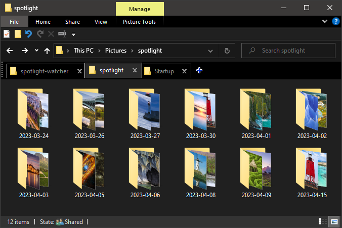

# Windows Spotlight Watcher v1.0

---

---

Spotlight Watcher is a Python script that automatically copies the images downloaded by Windows Spotlight to your local Pictures directory.

Windows Spotlight is an option for the lock screen background that displays different background images and occasionally offers suggestions on the lock screen. Windows Spotlight is available in all desktop editions of Windows 10.

[You can read more here](https://learn.microsoft.com/en-us/windows/configuration/windows-spotlight)

---

## Installation

### Prerequisites

- Python 3.9 or later
- Windows Operating System

### Clone the Repository

Clone this repository to your local machine using [https://github.com/yourusername/spotlight-watcher.git](https://github.com/yourusername/spotlight-watcher.git)

### Install Dependencies

There are no additional dependencies required to run the script.

## Usage

To use Spotlight Watcher, simply run the `spotlight.bat` file on Windows.

The script will automatically run in the background and copy any new Windows Spotlight images to your local Pictures directory.

## Automation

You can create a shortcut to your batch file by right-clicking on the batch file ( `spotlight.bat`) and selecting "Create shortcut".

You can move the shortcut to the Windows startup folder,

Press the Windows key + R to open the Run dialog box.
Type "shell:startup" (without the quotes) and press Enter. This will open the Windows startup folder.

which is located at %AppData%\Microsoft\Windows\Start Menu\Programs\Startup.

Cut or copy the shortcut to the clipboard.
Paste the shortcut into the startup folder.

Now, every time you logs into your Windows account, the batch file will automatically run.

## Configuration

You can modify the destination folder for the copied images by editing the `new_folder_path` variable in the `spotlight.py` file.

## Contributing

Pull requests are welcome. For major changes, please open an issue first to discuss what you would like to change.

## License

[MIT](https://choosealicense.com/licenses/mit/)
